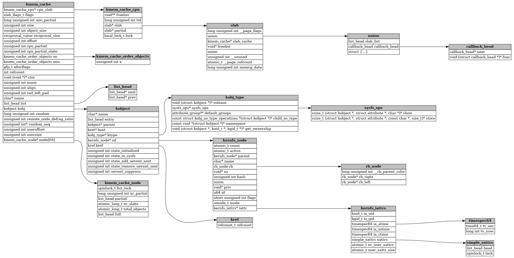

# Debug Struct Visualizer

Converts a struct in the type info of a specified binary to an interactive graph using:
 - gdb -- for it's python api which includes an easy-to-use interface to access loaded type information, so any debug info format that gdb supports is supported
 - graphviz -- for it's graph generation capabilities
 - pywebview -- provides a view of the interactive generated graph without needing to bother with a browser and web server

# Dependencies:
python dependencies will be installed with module installation:
```
pip install .
```
additional requirement: gdb and graphviz's 'dot' executable must be found in path

on ubuntu:
```
sudo apt install gdb graphviz
```

# Usage:
```
dsviz <path-to-binary> <name-of-root-struct> (output-file)
```
if output-file is specified the graphviz dot file will be written to that file each time the graph is updated via interactions

to expand a struct field, right click on the field name and click 'Expand' in the context menu that appears

# Examples:

## vmlinux:

### struct kmem_cache

`dsviz ~/kernel/linux-6.1-rc3/vmlinux "struct kmem_cache"`




### struct cred

`dsviz ~/kernel/linux-6.1-rc3/vmlinux "struct cred"`


# TODO:
- support closing graph nodes from right click context menu
- expand command line options, use argparse
- validate gdb and dot are in path
- see if graphviz2drawio works with the graphviz dot files im generating
- many other things...
